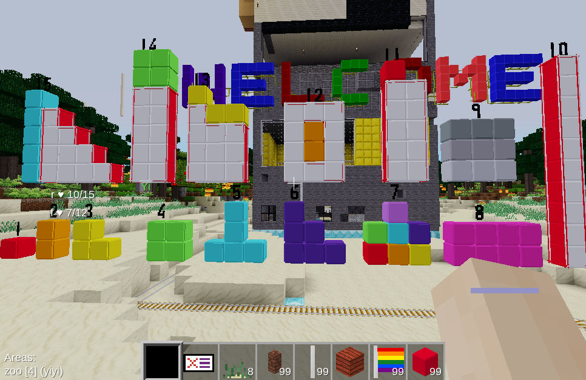
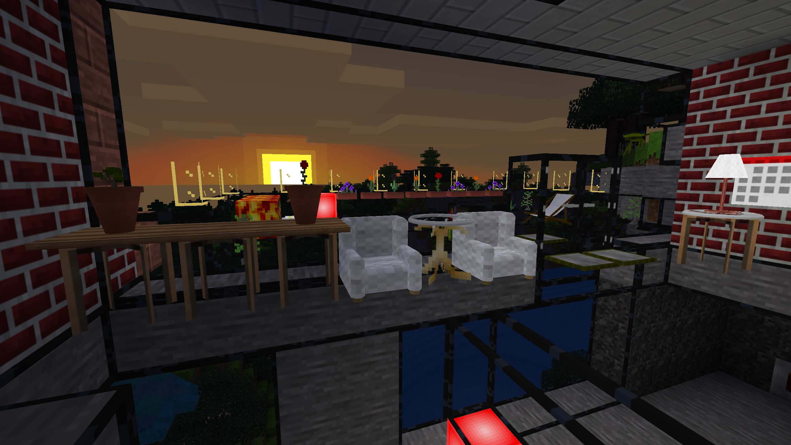

[English](./README.en.md)

## 什么是 《莽兜世界:教育版》

《[莽兜世界:教育版](https://edu.ihom.app)》是基于[Minetest][minetest]（一款开源体素游戏引擎）打造的开源互动教育世界应用。

欢迎访问网站: https://edu.ihom.app 获得更多信息.

### [Minetest][minetest]的互动游戏世界

[Minetest][minetest]的“[体素](https://zh.m.wikipedia.org/zh-hans/體素)”概念类似于积木（如乐高积木）.在互动世界里你可以用"积木"创建房子、制作工具，而与价格昂贵的乐高积木不同的是，你可以在你的创作里面走动，体验你所创造的“新世界”。

 

#### Experience(Enjoy) the "New World" You Created

在互动世界里你可以用材料"积木"创建房子，农场，城市，工具和许多其他令人难以置信的创造性的事情。例如，金属矿开采，雕琢成锭，用于制作镐或其他物体不同的金属工具，然后用来建造建筑物,或者其他你可以想象的任何结构。而与成百上千元的乐高积木不同的是，你可以在你的创作里面走动，体验你所创造的新世界。例如，您可以构建和使用梯子，您可以将砂烧制成玻璃块，并将之作成窗户，透过这扇窗，能从你的门廊，看着 Minetest 世界中的方形太阳冉冉升起。

[minetest]: https://minetest.net

>[维基百科]https://zh.m.wikipedia.org/zh-hans/Minetest《Minetest》已在教育中广泛用于教授数学，程序设计和地球科学等学科。与同类应用程序相比而言，它的优势在于应用本身零成本,开放可定制，可在教室或研究等各类环境中进行大规模部署。
> 此外，Minetest的图形引擎在低成本和低端硬件上表现[出色](https://en.wikinews.org/wiki/Open_source_game_developer_Perttu_Ahola_talks_about_Minetest_with_Wikinews)。
>
> * Minetest被用作辅助设计工具，用于远程教学。
> * Minetest用于向中小学生教授逻辑思维和调试。
> * 2017年的法国，Minetest被用来教授微积分和三角学。
> * 在巴西的圣卡塔琳娜州联邦大学，MineScratch（Minetest的变体）被用来教学。
> * 2018年，在巴黎笛卡尔大学，Minetest用于向六年级的学生讲授生命和地球科学；这些学生无法亲自观察到某些现象，但可以在Minetest虚拟世界中体验到这些现象。

### 《[莽兜世界:教育版](https://edu.ihom.app)》的互动教育世界

放任孩子在游戏世界中玩耍，并不能起到任何教育的作用。孩子在游戏世界的无脑玩法，是让人万万想不到: 从高处跳下自杀（孩子称之为蹦极），复活后，又跑去...这都能玩个不亦乐乎。

家长/老师需要管理游玩的内容，以及控制游玩的时间，并能在游玩的间隙插入一些知识的练习。最好能用最简单的方式编写互动教育世界的课程任务。

- [X] 分离游玩界面和游玩世界管理界面
- [X] 控制游戏时间，保护孩子的眼睛
- [X] 在游玩的间隙插入练习
- [X] 单机游戏支持不同用户使用共用电脑
- [ ] 文字编写互动教育世界教案课程(待实现`Text To Game`)

## 与《[我的世界:教育版](https://education.minecraft.net/)》的比较 🎯

|        | [我的世界:教育版](https://education.minecraft.net/)  | 《[莽兜世界:教育版](./)》 |
| :------| ------------------------- | ------------- |
| 离线    | 只能联机使用（进入前必须登陆）  | 可以离线运行的软件（无需注册登陆，无网也可用） |
| 类型    | 收费的商业软件  | 自由(免费)的开源软件  |
| 人群    | 只针对教育机构，不对个人开放  | 家长/老师均可自由使用 |
| 课程    | 约 700 节的线上课程  | 暂无 |
| 模组    | 不支持  | 本地内置教育相关模组（数学,自动化,电子电路,编程等）及精选模组 |
| 自架服务 | 不支持  | 可自架本地网络或互联网游戏服务 |
| 游戏时间控制  | 不支持  | 支持控制游戏时间 |
| 游戏内容管理  | 不支持  | 支持游戏内容管理 |
| 穿插练习  | 不支持  | 支持在游玩的间隙穿插练习 |

---

- [我的世界:教育版](https://education.minecraft.net/)：
  - 本质是一项联机服务（进入前必须登陆）
  - 收费的商业软件
    - 无法对软体本身进行修改或改进
  - 只针对教育机构，不对个人开放（个人必须依托于机构）
  - 游戏内库中内置了 700 节符合标准的课程（不是本地内置，需要在应用内下载）
  - 课程编写麻烦：本质上是在游戏内建造
  - 不支持自架本地网络或互联网游戏服务
  - 不支持控制游戏时间
  - 不支持游戏内容管理
  - 不支持游玩的间隙穿插练习
- 《[莽兜世界:教育版](./)》:
  - 本质是一可以离线运行的软件（无需注册登陆，无网也可用）
  - 自由(免费)的开源软件
    - 在遵循其开源版权许可证([LGPL3](https://www.gnu.org/licenses/lgpl-3.0.zh-cn.html))书前提下可对软体本身进行修改或改进
  - 家长/老师均可自由使用
  - 可自由组合的模组架构设计
  - 本地内置教育相关模组（数学,自动化,电子电路,编程等）及精选模组.
  - 暂时无课程，需自行创建
  - 支持自架本地网络或互联网游戏服务,进行多人游戏
  - 支持控制游戏时间
  - 支持游戏内容管理
  - 支持游玩的间隙穿插练习

## 下载

* 国外: https://github.com/edu-minetest/minetest/releases/
* 国内镜像: https://gitee.com/mt-edu/minetest/releases

## 源代码地址

* Github : https://github.com/edu-minetest/minetest/
* Gitee 镜像: https://gitee.com/mt-edu/minetest/

本分支(`Release`)只为发布而设立.

所实话我并不想建立独立的minetest版本,为了随时能够合并回主分支,采用独立功能分支的方式进行开发.
`Minetest:Edu`的主功能分支在:`edu/builtin`,以及一系列以`edu/`打头的子功能分支组成.

分支说明:

* `edu/builtin`: 新增学生界面和教师界面
* `edu/settings/binary`: 新增支持二进制配置文件
* `edu/drawHeader`: 修正drawHeader
* `edu/static_spawnpoint`: 修正出生点问题
* `edu/android/client-translation`: 修正android默认中文问题
* `feat/singleplayer-user`: 支持多用户在单机游戏中

## 源代码版权声明

* [Minetest 体素游戏引擎](https://minetest.net/)遵循[LGPL2.1](https://www.gnu.org/licenses/old-licenses/lgpl-2.1.html)版权许可证
* 《莽兜世界:教育版》遵循[LGPL3](https://www.gnu.org/licenses/lgpl-3.0.zh-cn.html)开源许可证

